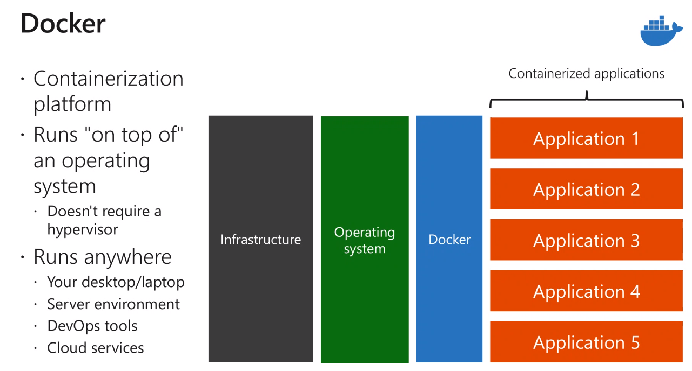

# Azure Developer Training

## Resources

- [Learining Path](http://aka.ms/az204/learningpath)
- [Walkthrough](http://aka.ms/az204/guidedwalkthroughs)
- [Study Guide](http://aka.ms/az204/studyguide)
- [Microsoft Training Site](https://tsfb.learnondemand.net/) D601DDF2

## Deeper Dive

- hybrid connections
- app service local cache

## Takeaways

- you can get IP addresses for app services to IP filter their dependencies
- storage accounts could have tighter access control

## App Services

- supports .NET, Java, Ruby, Node.JS, PHP, Python
- execute in a managed sandbox environment
- scalable
- near instant deployment
- connectors to SaaS platforms, including Salesforce, Facebook, etc.
- secure and compiant
- **App Service Plans** can group applications together within a subscription
  - dictate billing
  - **SHARED** app service plan **IS NOT** available for Linux apps
- built in authentication and authorization support
- user claims are made available to code
- built in toke store
- logging and tracing enabled for authentication events
- support for popular identity providers: Google, Facebook, etc.
- **Hybrid Connections** - enable access to resources in other networks
  - invovles a hybrid resource connection
- **Traffic Manager** routes requests, configured using proviles
  - can be based on Priority, Weighted (could distribute evenly), Performance, or Geographic
- Azure App Service Local Cache - provides a write but discard cache
- **App Service Environments**
  - used for high scale
  - virtual network
  - dedicated resources
- can run on either Linux or Windows
- can run in **App Service on Linux**
  - containers can easily be sourced from Docker Hub or Azure Container Registry

### Azure CLI commands

```sh
az appservice plan create --name $name --resource-group $rgname --sku FREE

az webapp create --name $webappname --resource-group $rgname --plan $ webappname

az webapp deployment source config --name $webappname --resource-group <resourcegroupname>  --repo-url <githuburl> --branch master --manual-integration

# creates an application with a bunch of defaults, including resource group and plan
az webapp up --location ... name <appname> --html

az group delete --name ManagedPlatform --no-wait --yes
```

### Powershell commands

```powershell
New-AzWebApp

New-AzAppServicePlan

New-AzResourceGroup
```

### App Settings

- overrides web.config or appsettings.json
- sets app settings, connection strings, default documents, path mappings, custom containers
- hidden by default in the Azure Portal

#### Default Documents

- only available for Windows Apps

#### Path Mappings

- used to map container storage

### Commands

```sh
az webapp config set ...
```

### CORS

Mechanism for servers to indicate which requests they support

### IP Addresses

- single inbound IP addresses
- a set of outbound IP addresses
- IP can change if you delete and recreate app, or delete SSL binding

```sh
az webapp show --query outboundIPAddresses --output tsv
```

### Scaling

Criteria include:

- CPU
- Memory
- Disc queue length
- Http queue
- Data in
- Data out

Highlights

- Can schedule scaling based on various criteria: days of the week, etc.
- every scale out rule should have a corresponding scale-in rule
- app service can have a single autoscale setting
  - setting can have one to many profiles
  - profile can have one-to-many scaling rules
- best practices
  - maximum and minimum values are different
  - manual settings are overwritten by auto-scale settings
  - always use scale-out and scale-in together
  - choose the correct metric and thresholds carefully

### Deployment Slots

- can swap slots, they swap only after warmed up
- can push a percentage of traffic

```sh
az webapp deployment slot swap ---....
```

## Azure Functions

### Overview

- Can be triggered in different ways:
  - HTTP request
  - Azure events (Event Grid or Event Hub)
  - Schedule
  - Service bus queues and topics
  - Triggers based on third party services, such as GitHub
- Should generally be smaller pieces of logic
- built on **WebJobs** code
- supports a variety of programming languages
  - C#
  - JAVA
  - PHP
  - Python
  - JS
  - etc.
- can utilize a **Consumption** or **App Service** plan
- Bindings
  - connect to services without writing the plumbing
  - credentials are NOT stored in code
- Azure Virtual Networks can be integrated with Functions, but require a **Premium Plan**

### Best Practices

- avoid long running transactions
- use queues for cross-function communication
- for direct communication use Durable Functions or Logic Apps
- Functions should be stateless and idempotent
- state data should be associated with inputs and outputs
- code defensively

### Developing

- can edit in the portal

### Durable Functions

- can write **stateful** functions
- manages state, checkpoints, and restarts
- allows for **chaining** of functions together; a durable orchestrator can call other functions in sequence
- allows for **fan-out** model in which one function can call others in parallel

## Azure Blob Storage

- object storage for the cloud
- designed for
  - serving images or documents
  - video and audio
  - log files
  - backup files
  - available via HTTP/HTTPS API
- 3 tier hierarchy
  - Storage Account
  - Container
  - Blob
    - Block Blob
      - up to 100 MB chucks
      - can be comprised of up to 50,000 blocks
    - Append Blob
      - optimized for append
      - good for logs
    - Page blobs (hard drives)
      - composed of 512-byte pages
      - used for virtual hard disks
- availability options (Access Tiers)
  - Local Redundant Storage
  - Zone Redundant Storage
  - Geo-redundant Storage
  - Geo-redundant + read access in secondary
  - Geo-zone redundant
  - Geo-zone redundant with read access in secondary
- Storage Tiers
  - Premium - Low and consistent latency dta
  - Hot - frequently accessed data
  - Cool - less frequently accessed data
  - Archive - rarely accessed data
- Lifecycle Management
  - rule based automation for data tiering and retention
  - runs daily on storage account
  - can set rules to:
    - move files from Hot to Cold
    - move files to Archive
    - delete files
    - delete snapshots
- Types of storage

  - containers
  - file shares
  - tables
  - queues

  ### [Code Snippet](./azure.storage.md)

## IaaS Solutions (Virtual Machines and Containers)

### Provision VMs

Virtual Machines can use 2 types of disks

1. Standard
2. Premium - uses SSD for top performance on I/O intensive workloads

You can choose either:

- unmanaged disks - manually create and manage virtual hard disks
- managed disks - Microsoft takes care of overhead

#### Create a VM

- can pick from temlates
  - based on processing, memory, disk, networking
  - categories:
    - General
    - Compute
    - Memory
    - Storage
    - GPU
    - High Performance Compute
- basics
  - region
  - resource group
  - authentication type
    - SSH public key
    - password
  - Admin user name
  - inbound port rules
- disks can pick from:
  - Standard HDS
  - Standard SSD
  - Premium SSD
- Advanced
  - Use Managed Disks
  - Set a Storage Account
- Networking
  - can join a VNet or create one
  - can select inbound ports (SSH, HTTP, etc.)
- Other
  - Use Managed Identity
  - Use AAD to login
  - setup auto-shutdown

#### Highlights

- **PerfInsights** will send out metrics on the VM
- single VM SLA 99.9%, Multi VM: 99.99%


```sh
New-AzVM -Name -Location

Get-AzPublicIpAddress -ResourceGroupName <name>
```


### ARM Templates

- multiple resources can utlize **nested templates**
-

```sh
az group deployment create --name <name> --resource-group <rg-name> --template-file <json file>
```

### Container Images

- Containers run on top of VMs so are much more efficient because they don't contain the entire VM image

#### Terms

- Container - everything needed for an application to run
- Container Image - a template used to create one or more containers
- Build
- Pull
- Push
- Dockerfile - text file containing build instructions

```sh
docker pull ubuntu

docker pull mysql:5.7

docker pull mysql:latest

docker pull

docker run mcr.microsoft.com/xxx/ss/d/sds

docker container ls -a
```

```sh
FROM node:8.9.3-apline
RUN mkdri -p /usr/scr/app
COPY ...
WORKDIR  ...
RUN npm install
CMD node /usr/src/app/index.js
```

> **_[Azure Samples on GitHub](https://github.com/Azure-Samples?q=aci&type=&language=)_**




### Container Registries

#### Azure Container Registry (ACR)

Integrates closely with

- Azure app service
- Azure service fabric

Terms

- Registry
- Repository - group of related images
- Image
- Container

Container Registry SKU's

- Basic:
- Standard:
- Premium: more storage and more concurrent operations, geo-replication

```sh
az acr create --resource-group <group> --name --sku

docker pull microsoft/aci-helloworld

az acr list --query ....to get the login server name

#gets the login server name
az acr show -- name <acrname> --query loginServer --output table

#you need to tag the image with the login server name
docker tag <image-name> <loginservername>/<imagename>:v1

docker push ...
```

```sh
#to run a container based on an ACR image
az container create --name --image --resource-group --registry-login-server ....
```

> [AZ container create documentation](https://docs.microsoft.com/en-us/azure/container-instances/container-instances-using-azure-container-registry)

```sh
#pushes a
az acr build --registry $acrName --image ipcheck:latest .
```

## Key Vaults and Secret Management

- Can enable purge protection
- Soft delete with a retention period
- Premium tier allows for HSM key backup
- Access Policies
  - Enable Access for:
    - Virtual Machines for deployment
- Networking
  - VNet

### When setting secrets

- can set value, name, activation date, expiration data, enabled (Y/N)
- can then get a **Secret Identifier** which is the URL to the secret

### When setting Keys

- name
- can set RSA or EC
- key size
- activation date
- expiration data

### When setting certificates

- can generate or import
- certificate name
- type of certificate authority
- renewal frequency

## Managed Identities

- User Assigned - can be assigned to multiple resources; is created in the portal using the **User Assigned Managed Identity** resource type
- System Assigned - can be used within a single resource


## API Management Overview

Benefits of API Management

- Authentication
- Versioning
- Creates a developer portal
- Managines caching, throttling, and other policies
- Monitoring and analytics

### Terms

- Backend API
- Frontend API
- Product - one or more API's packaged together, can be Open or Protected
- Operation - operation called by consumer
- Version - a breaking change to the front-end API
- Revision - a non-breaking change, can't have side-by-side revisions
- Developer Portal

### Policies

Collection of statements that are executed sequentially at the request or response of an API

- a quick way to adjust behavior without code
- logging
- mocking responses
- retry logic
- limit concurrency
- filter IP addresses
- rewrite URL
- adjust query parameters

### Subscriptions

Tie Developers to Products. Can generate keys for subscriptions.

- Subscriptions can have different **Scopes**

### Developer Portal

Allows developers to sign up and get access to APIs, that expose the operations.

## Logic Apps

- An Automation workflow solution
- no code
- prebuilt templates
- out of the box connections to SaaS solutions
- BizTalk API's available
- JSON based workflow definition
- can be deployed using ARM templates
- can connect to on-premises, hybrid and cloud applications
- can execute complex integration scenarios

### Terms
- Workflow
- Triggers - can be Polling or Push
- Actions
- Connectors (Lots of them)


### Enterprise Integration

1. Create an integration account
2. Connect everything to the account

### Tools

1. Portal
2. Visual Studio
3. VS Code

> Can be built using the Visual Designer or through code

### Connectors

- Lots of pre-built connectors
- Can be built custom

### Templates

- workflow templates can be imported and then used to build your own workflows

## Event Based Solutions

### Event Grid

- allows you to easily build event-based architectures
- lots of Azure resources can send Event Grid events
  - Subscription Mgmt Operations
  - Custom Topics
  - IoT
  - Service Bus
  - etc.
- Subscribers include
  - functions
  - logic apps
  - webhooks
  - queue storage
  - event hubs

#### Standard Schema

- topic
- subject
- id
- eventTime
- eventType
- data
- dataVersion

#### Security in Event Grid

- Webhook - requires that you prove ownership (Except for Azure Functions, Logic Apps, or Azure Automation)
- Event Subscriptions
  - Uses RBAC permissions to ensure that you ahve acces to the resources needed
- Custom Topic
  - key based or 

#### Filtering

- setup on subscriptions
- by subject:  begins with, ends with, etc.
- by type

#### Setup

1. Register the Event Grid provider
2. create type
3. create subscription with endpoint

### Event Hubs

- high throughput, streaming events
- events are divided by a **partition key** to identify the source
- **consumer groups** 
- data can be automatically captured and stored in Azure Blob storage or Azure data lake
- Capture time or zize intervals can be specified
- You can specify a window for capturing
- Data is stored using a standard naming convention
  - {}/{}/{}/{}/{}/{}/{}
- **Kafka** does the same thing; you can integrate with **Kafka MirrorMaker**
- Security
  - Only clients can preset valid credentials
  - publishers can send, but not receive messages
  - a client cannot impersonate another client
  - a rouge client can be blocked from sending data 
  - SAS keys can be created with permissions and can be created via code
- Tiers
  - Basic - 1 consumer group and throughput
  - Standard - 20 consumer groups


### IoT Hub

- can PUSH AND PULL messages from devices


## Messaging Solutions with Service Bus


- can configure
  - time to live
  - lock duration
  - duplicate detection
  - size
- explorer (in preview)

## Storage Queues


## CosmosDB

- global replication
- 5 consistency models
- 10 ms reads and 15 ms writes at 99% SLA

### Consistency Levels
- Strong 
- Bounded Stateless
- Session
- Consistent Prefix
- Eventual


### APIs
- MongoDB
- Table
- Gremlin API
- Cassandra
- SQL API

### Stored Procedures
- can be written in different languages, including JavaScript
- Bounded Context
  - operations must complete in a limited amount of time.
  - can be rolled back or forward
- **continuation** can be used to resume an operation that didn't complete or finish
- **Optimistic Concurrency** - there's an If-Match header that can be used to determine if a document should be updated

### User Defined Functions


### Triggers

## Azure SQL Database
- relational
- shares code and features with SQL Server
- 2 purchasing models
  - vCore-basesd compute purchasing
  - DTU based throughput purchasing
- **Azure SQL Server** allows you to manage your own server and have multiple databases on one server.  **Azure SQL Database** is simpler if you only need one database.