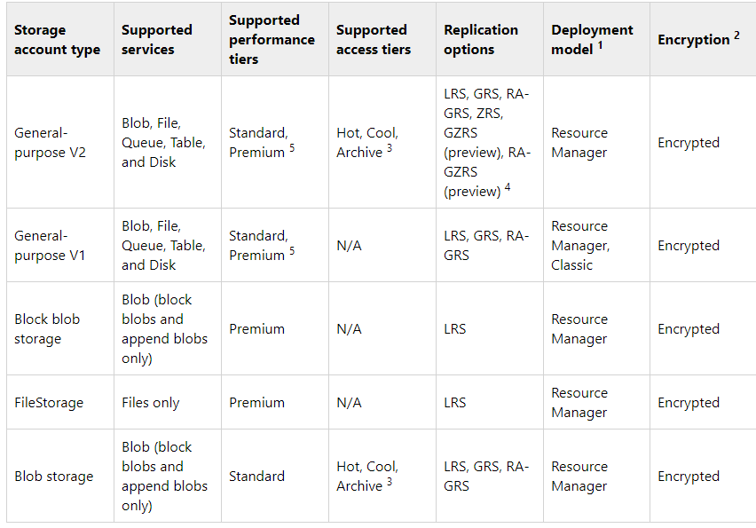

# Skills Measured

As I'm preparing for the AZ-204 Exam.  These are my notes that following the official [Skills Measured](https://query.prod.cms.rt.microsoft.com/cms/api/am/binary/RE4oZ7B) document published by Microsoft.

## Develop Azure compute solutions (25-30%)

### Implement IaaS solutions
#### provision VMs
- IaaS Offering Consisting of:
  - Servers and Storage
  - Networking firewalls
  - Physical hardware
- VM name is a maximum of 15 characters long
- By default the VM name and computer name are the same.  They can differ if you upload your own OS image.
- locations can be across the globe
```bash
az account list-locations
```
- only 64-bit operating systems are supported
- VM's require that the following resources exist:
  - resource group (REQ)
  - storage account (REQ)
  - virtual network (REQ)
  - public IP address (NOT REQ)
  - network interface (REQ)
  - data disks (REQ)
- various sizes exist
  - General Purpose
  - Compute Optimized
  - Memory Optimized
  - Storage Optimized
  - GPU Optimized
  - High Performance Compute
- WARNING: resizing causes a restart, which can reconfigure the IP address
- **Availability Sets** 
  - provide redundancy within a datacenter
  - RECOMMENDATION: at least 2 VM's per availability set to meet 99.95% SLA
  - Availability sets carry no additional cost on their own
- **Fault Domains**
  - share a common power source and network switch
  - Azure automatically distributes VM's from an Availability SET into DIFFERENT fault domains
- **Update Domains**
  - a logical group of hardware that can undergo maintenance / reboots at the same time.  Only one update domain is updated at a time
  - as you create VMs within an availability zone, Azure puts them in separate update domains
- **Linux** VMs
  - many flavors, including Ubuntu, CentOS, Core OS, Oracle Linux, Red Hat

#### configure VMs for remote access
#### create ARM templates
- Resource Manager
  - a deployment and management service in Azure
  - authenticates and authorizes
  - receives requests from API, CLI, SDKs, etc
  - provides consistent results regardless of the tool used
  - Terms
    - Resource
    - Resource Group
    - Resource Provider - provides operations related to a particular type of resource
    - Resource Manager Template (ARM template) - JSON file that defines resources
    - Declarative Syntax - explains "what I want to create", but NOT how to do it
- SCOPE
  - There are 4 levels (KNOW THESE)
    - Management Group
    - Subscriptions
    - Resource Groups
    - Resources
  - management settings can be applied at any level
  - Lower levels inherit from higher levels
  - You can deploy ARM templates to Management Groups, Subscriptions, or Resource Groups, but NOT TO RESOURCES
  - when you deploy a template, Resource Manager converts the template into REST API operations
  - multi-tiered applications can be deployed as a single template or multiple templates
  - **NESTED TEMPLATES** can be referenced from **PARENT TEMPLATES**, which enables re-use
  - **dependencies** in templates tell Resource Manager the order in which to deploy related resources
  - if the specified resource already exists, Resource Manager will update the resource
  - **Extensions** provide a way to work with Resource Manager via tools like Chef, Puppet, or DSC
  - templates can be managed in source control as code
  - the **`condition`** element in a template is used to specify if a particular resource should be deployed
  - **`reference`** or **`list`** functions within conditional resources are ALWAYS evaluated, even if the conditional resource is not deployed
  - **`if`** can be used to ensure that a function is only evaluated under certain conditions
  - Deployment Modes for Resource Manager
    - there are 2
      - Complete - will remove any existing resources in the resource group if they're not in the template
      - Incremental - will not touch any resources in the resource group that are not in the template
    - in either mode, Resource Manager tries to create/update resources in the template
    - if you try to update the location or type of an existing resource, the deploy fails
    - **API Versions**
      - before version **2019-05-10**, if resources are omitted due to a **condition**, they weren't deleted
      - starting with **2019-05-10**, omitted resources due to a **condition** ARE deleted
    - NOTE: DELETE mode applies to **`COPY`** loops too
    - IN EITHER MODE: updated a resources are always updated to reflect the template, including the removal of properties

```powershell
New-AzResourceGroupDeployment -Mode Complete
```

```bash
az group deployment create -- mode Complete
 ```

#### create container images for solutions by using Docker

- Containers
  - run images Without VM's
- Docker 
  - containerization platform used to be build and run containers
  - doesn't use a hypervisor
  - desktop version of Docker supports Linux, Windows, and macOS
  - Terms
    - Docker Client: tool that provides CLI support using the `docker` command
    - Docker Server: daemon named `dockerd` that responds to the docker client via the Docker REST API.  Tracks the lifecycle of containers.
    - Docker Objects: things needed to support our containers, including:
      - networks
      - storage volumes
      - plugins
      - other service objects
    - Docker Hub: a SaaS Docker container registry.  The default registry for Docker
    - Container Image: portable package that contains software.  Images are **immutable**.
    - Container: a running instance of an image.
    - Host OS: host that provides the kernel on which the container runs.
      - Linux containers can access the Host OS kernel
      - Windows containers require their own OS, but use the Host OS to access system resources like files, network, & memory.
    - Container OS: the OS that is part of the packaged image
  - `Unionfs` - a filesystem that allows image layers to be stacked and operate as one
  - Docker `scratch` image: the base layer that Docker assumes will access the host OS kernel.
  - Base Image: uses the Docker `scratch` image, which doesn't layer on OS
  - Parent Image: the container image containing the OS (and maybe other things) onto which we layer our applications

##### Dockerfile
- The **Dockerfile** is a text file that contains instructions to build a Docker image:
  - the base or parent image
  - commands to update the base image and add software
  - build artifacts to include
  - services to expose, such as storage and network config
  - commands to run when the container is launched
  - when each step executes, a new layer gets added to the image
  - with each step, a new temporary image is created and kept in cache, eventually discarded

```bash
# Step 1: Specify the parent image for the new image
FROM ubuntu:18.04

# Step 2: Update OS packages and install additional software
RUN apt -y update &&  apt install -y wget nginx software-properties-common apt-transport-https \
	&& wget -q https://packages.microsoft.com/config/ubuntu/18.04/packages-microsoft-prod.deb -O packages-microsoft-prod.deb \
	&& dpkg -i packages-microsoft-prod.deb \
	&& add-apt-repository universe \
	&& apt -y update \
	&& apt install -y dotnet-sdk-3.0

# Step 3: Configure Nginx environment
CMD service nginx start

# Step 4: Configure Nginx environment
COPY ./default /etc/nginx/sites-available/default

# STEP 5: Configure work directory
WORKDIR /app

# STEP 6: Copy website code to container
COPY ./website/. .

# STEP 7: Configure network requirements
EXPOSE 80:8080

# STEP 8: Define the entry point of the process that runs in the container
ENTRYPOINT ["dotnet", "website.dll"]
```
##### Tags

- tags are used to version an image
- use the `-t` command to apply a tag
- a single image can have multiple tags
- by convention, the most recent version is assigned the `latest` tag

##### Docker Commands
```bash
# to build
docker build -t temp-ubuntu

# to view images on local machine
docker images

# to remove an image from the local registry
docker rmi

# other commands
docker run <name>

docker pause <name>

docker restart <name>

docker stop <name>

docker remove <name>
```

##### Persisting data in Docker

You have 2 options to persist data with containers:
1. Volumes: are located on the host file system and can be accessed by multiple containers.
2. Bind Mounts: similar to volumes but have less functionality.  More performant, but require the host to have a particular folder structure.

##### Networks with Docker

You have 3 networking options with Docker:
1. Bridge
    - default configuration
    - an internal private network
    - containers can access other containers on the bridge
    - use the `--publish` command to map container ports to host ports
2. Host
    - gives the container access to the host's network
    - the container can only use ports not already in use by the host
3. None
    - disables networking for the container

> NOTE: networking differs based on OS.

#### publish an image to the Azure Container Registry

- there are three SKU sizes for registries
  - Basic
  - Standard
  - Premium
- login to registry using the `docker login` command
- **ACR Tasks** is a suite of features within ACR that provides image building for various platforms.
- benefits of ACR
  - Encryption-at-rest
  - Geo-redundant storage
  - Geo-replication (Premium)

#### run containers by using Azure Container Instance

- ACI is useful for running isolated containers.
- Benefits include:
  - Fast startup
  - per second billing
  - hypervisor security - as good as in a VM
  - custom sizes
  - persistent storage
  - linux and windows

  > for full container orchestration, AKS is recommended

  - Container Groups
    - are scheduled on the same host machine
    - share a lifecycle, resources, network, and storage volumes.
    - similar to a `pod` in Kubernetes
    - multi-container groups are ONLY supported on Linux, not Windows
    - 2 common ways to deploy groups
      - using an ARM template; recommended when other resources are needed
      - using a YAML file; recommended when deploying ONLY container instances
    - container groups can have one of 3 restart policies
      1. Always: always restarted
      2. Never: never restarted
      3. OnFailure: restarted only when the process in the container fails

```bash
az container create --restart-policy OnFailure
```

##### Environmental Variables in Containers

- set variables
- for secure settings, use `secureValue` in the YAML instead of `value`, which prevents the value from being accessible via the container's properties

```bash
az container create --environment-variables 'NumWords'='5' 'MinLength'='8'
```

##### Azure File Shares for Container Instances

- by default, containers are stateless
- you can mount an Azure File Share, but ONLY for Linux containers
- to mount a file share, you need 3 things:
  1. storage account name
  2. share name
  3. storage access key

    ```bash
    az container create \
      --resource-group $ACI_PERS_RESOURCE_GROUP \
      --name hellofiles \
      --image mcr.microsoft.com/azuredocs/aci-hellofiles \
      --dns-name-label aci-demo \
      --ports 80 \
      --azure-file-volume-account-name $ACI_PERS_STORAGE_ACCOUNT_NAME \
      --azure-file-volume-account-key $STORAGE_KEY \
      --azure-file-volume-share-name $ACI_PERS_SHARE_NAME \
      --azure-file-volume-mount-path /aci/logs/
    ```
  - you can also mount
    - multiple volumes
    - mount volumes by using YAML

  - set WEBSITES_ENABLE_APP_SERVICE_STORAGE to enable the `/home` directory to be shared across scale instances

> Azure Kubernetes Service (AKS) is out of scope

### Create Azure App Service Web Apps

- deployment slots

#### create an Azure App Service Web App

##### App Service Plans

- the higher the tier, the more features are available
- 4 types
  - Shared Compute
    - Free & Shared
    - includes apps from other customers on the same VM
    - only intended for development
  - Dedicated Compute
    - Basic, Standard, Premium, and Premium V2
    - only apps in the same plan share VM compute
  - Isolated
    - dedicated VMs on dedicated networks, which provide network isolation
  - Consumption
    - ONLY for function apps

#### enable diagnostics logging
#### deploy code to a web app
#### configure web app settings including SSL, API, and connection strings
#### implement autoscaling rules, including scheduled autoscaling, and scaling by operational or system metrics

### Implement Azure functions
#### implement input and output bindings for a function
#### implement function triggers by using data operations, timers, and webhooks
#### implement Azure Durable Functions

## Develop for Azure storage (10-15%)
### Develop solutions that use Cosmos DB storage
#### select the appropriate API for your solution

- Cosmos DB offers several APIs


#### implement partitioning schemes
#### interact with data using the appropriate SDK
#### set the appropriate consistency level for operations
#### create Cosmos DB containers
#### implement scaling (partitions, containers)
#### implement server-side programming including stored procedures, triggers, and change feed notifications

### Develop solutions that use blob storage
#### move items in Blob storage between storage accounts or containers

##### Storage Security Options
1. Azure Active Directory integration: for blobs and queues using RBAC
2. Shared Key authorization: for blobs, files, queues, and tables. requests pass a Shared Key in the header
3. Shared access signatures: for blobs, files, queues, and tables. limited delegated access to the account
    - is handy when clients need temporary access to files
    - there are 2 types:
        1. SAS Signature: 
            1. getting a key requires `Microsoft.Storage/storageAccounts/blobServices/generateUserDelegationKey` permission
            2. OR, use the storage account key
        2. SAS token: generated on the client and not tracked in Azure, can be handed out to clients
4. Anonymous public read access: for containers and blobs

##### Types
- General Purpose V2
  - offer the lowest per GB prices
  - recommended for most scenarios
  - offers Hot, Cool, and Archive
  - can upgrade from v1 or Blob to v2
- General Purpose V1
  - use if your REST API is earlier than 2014-02-14 or client library lower than 4.x
- Block Blob - Blob-only storage with premium performance characteristics
  - used with high transaction rates, using smaller objects
- FileStorage - Files-only storage account with premium performance
- Blob storage accounts - blob-only storage, use general purpose v2 instead

##### Highlights

- all storage is encrypted with 256-bit AESS encryption on disk
- KEYS
  - by default Azure manages keys
  - there are 2 other options
    - CUSTOMER MANAGED KEY - used to encrypt all data in the storage account
    - CUSTOMER PROVIDED KEY - provided on operations by the client
- only Storage V2 supports integration with Event Grid, not V1
- only storage accounts of type BlobStorage support integration with Event Grid
- the **change feed** provides transaction logs of all changes to blobs and blob metadata
- ONLY **General Purpose v2** and **Blob Storage** offer Hot, Cool, and Archive
- Classes
  - **CloudBlobClient** is a client that provides your blob service
  - **CloudStorageAccount** - represents the storage account
  - **CloudBlobContainer** - represents the container
  - **CloudBlockBlob** - represents a block blob; made up of blocks
- **LifeCycle Management Policies** let you:
  - transition blobs to a cooler storage
  - delete blobs at the end of their lifecycles
  - define rules that are run once per day at the store account level
  - apply rules to containers or a subset of blobs
- Archived blobs can be:
  - rehydrated to an online tier
    - **Standard Priority** (Default) can take up to 15 hours
    - **High Priority (Preview)** is prioritized over Standard Priority and may finish in under 1 hour
  - `Set Blob Tier` is used to rehydrate
  - `Copy Blob` command can copy a blob to a destination within the storage account
    - only storage account created after 6/7/2012 support copying from another storage account
  - copied to an online tier


##### Sample Lifecycle Policy
```json
{
  "rules": [
    {
      "name": "ruleFoo",
      "enabled": true,
      "type": "Lifecycle",
      "definition": {
        "filters": {
          "blobTypes": [ "blockBlob" ],
          "prefixMatch": [ "container1/foo" ]
        },
        "actions": {
          "baseBlob": {
            "tierToCool": { "daysAfterModificationGreaterThan": 30 },
            "tierToArchive": { "daysAfterModificationGreaterThan": 90 },
            "delete": { "daysAfterModificationGreaterThan": 2555 }
          },
          "snapshot": {
            "delete": { "daysAfterCreationGreaterThan": 90 }
          }
        }
      }
    }
  ]
}
```

##### Commands

```bash
New-AzResourceGroup -Name xxxx  -Location eastus
New-AzStorageAccount -ResourceGroupName xxx  -SkuName "Premium_LRS"
```

##### Tiers
- Hot
  - the default
  - reads are cheaper, but writes are more expensive
- Cool
  - writes are cheaper, reads are more expensive
  - best for data stored at least 30 days
- Archive
  - available only for individual block blobs
  - for data that can tolerate several hours of retrieval latency
  - for data that will remain in archive for > 180 days
  - storage is cheap, writes are expensive

##### 3 Types of resources

1. storage account
    - provides a namespace
2. container
    - organizes a set of blobs, similar to a folder
    - namespace can have an unlimited number of containers
    - a container can have an unlimited number of blobs
3. blob
    - 3 types of blobs
      - Block Blob - store text and binary data, up to 4.7 TB
      - Append Blob
        - optimized for append operations
        - ideal for logging operations
      - Page Blob
        - store random access files up to 8 TB
        - store virtual hard drive (VHD) files and serve as VM disks



```bash
# to copy storage data to another storage account
AzCopy 
```

#### set and retrieve properties and metadata
#### interact with data using the appropriate SDK
#### implement data archiving and retention
#### implement hot, cool, and archive storage

## Implement Azure security (15-20%)

### Implement user authentication and authorization

- MSAL = Microsoft Authentication Library
  - maintains tokens and refreshes them
  - no need to use OAuth

Different Flows
- Authorization Flow - for web apps that use the name of the user
- Client Credentials - services without user interactions
- On-behalf of - application calls a service, which then calls Graph
- Implicit - Browser Based Applications
- Integrated Windows
- Interactive - apps call graph
- Username/Password

2 Different Clients
- Confidential - servers
- Public - apps on public devices

ADAL Versus MSAL
- ADAL = Azure Active Directory Authentication Library
  - integrates with the v1.0 endpoint
  - for work accounts, not personal accounts
- MSAL
  - integrates with teh MS Identity Platoform v2.0 endpoint
  - gets authentications for Azure AD B2C


#### implement OAuth2 authentication
#### create and implement shared access signatures
#### register apps and use Azure Active Directory to authenticate users

- each application has 
  - 1 AD Application and 
  - many AD Service Principals - it needs one Service Principal in each tenant in which it's used
- a single tenant application has a single Service Principal

PublicClientApplicationBuilder & ConfidentialClientApplicationBuilder
- need 
  - Client ID
  - Identity Provider URL
  - Tenant ID
  - application secret (for confidential client app)
  - maybe a redirect URI

```csharp
var clientApp = PublicClientApplicationBuilder.Create(client_id)
    .Build();

string redirectUri = "https://myapp.azurewebsites.net";
IConfidentialClientApplication app = ConfidentialClientApplicationBuilder.Create(clientId)
    .WithClientSecret(clientSecret)
    .WithRedirectUri(redirectUri )
    .Build();
```

##### **Use .With methods to apply modifiers to builders**

**For PUBLIC AND CONFIDENTIAL applications**
- .WithAuthority()
- .WithTentantId()
- .WithClientId()
- .WithRedirectUri()
- .WithComponent()
- .WithDebugLoggingCallback()
- .WithLogging()
- .WithTelemetry()

**For CONFIDENTIAL applications**
- .WithCertificate()
- .WithClientSecret()

##### Lab Steps
1. App Registration
2. Create Console Application
3. Add Package and Using Statements
4. Add Authentication code
5. Acquire a token
6. Run the app

##### Microsoft Graph
- is fully replacing Azure Active Directory
- single endpoint: `https://graph.microsoft.com`
- you can use REST or SDKs
- supports GET POST PATCH PUT DELETE
- GET and DELETE require no body

```
https://graph.microsoft.com/{version}/{resource}?{query-parameters}
```

#### control access to resources by using role-based access controls (RBAC)

### Implement secure cloud solutions
#### secure app configuration data by using the App Configuration and KeyVault API

App Configuration
- NOT A REPLACEMENT FOR KEY VAULT; DON'T STORE SECRETS
- stores data as key-value pairs
  - keys are case-sensitive
  - key-value total size limit is 10,000 characters 
- tagging of settings with labels
  - used for environments
  - used for version
- point in time replay of settings
- accessible through client libraries
  - .NET Core or Framework
  - Java
- Values are unicode
  - they have an optional "user-defined content type"

##### Feature Management
- Feature Flag - on or off
- Feature Manager - handles feature flags for an application
- Filter - rule for evaluating the state of a feature flag
  - can be based on user group, geography, time, browser type, etc

```
"FeatureManagement": {
  "FeatureA": true, // Feature flag set to on
  "FeatureB": false, // Feature flag set to off
  "FeatureC": {
      "EnabledFor": [
          {
              "Name": "Percentage",
              "Parameters": {
                  "Value": 50
              }
          }
      ]
  }
}

```


#### manage keys, secrets, and certificates by using the KeyVault API

- uses industry standards to encrypt
- uses RBAC for Key Vault management
- uses Key Vault Access Policy for KV access
- Key Vault can have logging
  - can be archived to storage
  - can be streamed to Event Hub
  - can be sent to Azure Monitor
- replicates to secondary region for backup
- can manage certificate renewal and enrollment

Authenticate against Key Vault in 3 ways
1. Managed Identities
2. Service Principal and certificate (not recommended)
3. Service Principal and secret (not recommended)

- Key Vault can be managed using REST calls
- there is no default api version, so callers MUST specify the `api-version` query string parameter

#### implement Managed Identities for Azure resources

2 types:
1. User Defined
  - independent lifecycle
  - can be shared
2. System defined
  - tied to another resource
  - cannot be shared
  - use for workloads in single resource
    - when a single resource needs its own identity
  - can be used on a VM, you need the **Virtual Machine Contributor** role

##### System Assigned Managed Identity
```
az vm create \
    --resource-group myResourceGroup \
    --name myVM \
    --image win2016datacenter \
    --assign-identity \
    --admin-username azureuser \
    --admin-password myPassword12

az vm identity assign -g myResourceGroup -n myVm
```
##### User Assigned Managed Identity
```
az identity create -g myResourceGroup -n myUserAssignedIdentity

az vm create \
--resource-group <RESOURCE GROUP> \
--name <VM NAME> \
--image UbuntuLTS \
--admin-username <USER NAME> \
--admin-password <PASSWORD> \
--assign-identity <USER ASSIGNED IDENTITY NAME>

az vm identity assign \
    -g <RESOURCE GROUP> \
    -n <VM NAME> \
    --identities <USER ASSIGNED IDENTITY>

```


## Monitor, troubleshoot, and optimize Azure solutions (10-15%)

### Integrate caching and content delivery within solutions
#### develop code to implement CDNs in solutions
#### configure cache and expiration policies for FrontDoor, CDNs, or Redis caches Store and retrieve data in Azure Redis cache

### Instrument solutions to support monitoring and logging
#### configure instrumentation in an app or service by using Application Insights
#### analyze log data and troubleshoot solutions by using Azure Monitor
#### implement Application Insights Web Test and Alerts
#### implement code that handles transient faults

## Connect to and consume Azure services and third-party services (25-30%)

### Develop an App Service Logic App
#### create a Logic App

B2B
- 2 types of integration connectors
  - Electronic Data Interchange (EDI)
  - Enterprise Application Integration (EAI)

  5 Steps to Create B2B Logic Apps:
  1. Create Integration Account
  2. Add Partners, Agreements, and Artifacts
  3. Create Logic App
  4. Link Logic App to Integration Account
  5. Build Logic App with Artifacts


#### create a custom connector for Logic Apps

Create Custom Connector
- a wrapper around a REST API (SOAP also supported)
- the API's can be public or private

Secure your API
- OAuth
- API Key
- OAuth 2.0 for specific services (Azure AD, Dropbox, Github, Salesforce)
- Basic Authentication

Describe your API
- Open API
- Postman collection

Steps:
1. Build and Secure your API
2. Describe your API and define your connector
3. Use your connector
4. Share your connector (optional)
5. Certify your connector (optional)

#### create a custom template for Logic Apps

### Implement API Management

3 parts:
1. API gateway: accepts calls and routes to the backend
2. Azure Portal: administrative interface
3. Developer Portal: the main web presence for developers

Terms:
- Product
  - can be Open or Protected
- Groups
  - Administrators - the administrators of the APIs
  - Developers - the consumers
    - can be created or invited, or can sign in via the Developer Portal
    - is a member of one or more groups
  - Guests

#### create an APIM instance

3 Steps:
1. Create an APIM instance
2. Import your API
3. Create and Publish a Product

Commands
```bash
# create resource group
az group create

# create APIM instance
az apim create -n 
```

#### configure authentication for APIs

- Subscription Keys are needed to access APIs
- Each subscription has 2 keys:
  - primary 
  - secondary
- APIM also supports:
  - IP Whitelisting
  - OAuth 2.0
  - client certificates
- 3 Subscription Scopes
  - All APIs
  - Single API
  - Product
- HEADER is **Ocp-Apim-Subscription-Key**
- QUERY STRING is **subscription-key**
- TLS - APIM can check for certificate properties, such as:
  - CA
  - Thumbprint
  - Subject
  - Expiration Date

#### define policies for APIs

Policies allow changing of the API behavior.  Rules are executed sequentially.
- they are a collection of statements that execute sequentially
- can change both inbound and outbound messages
- **return-response** policy returns a 200 OK by default
- policy definition is a simple XML document divided into:
  - inbound  
  - backend
  - outbound
  - on-error
- policies can exist at different scopes; they get combined
- API Management has the following policies
  - Control Flow - conditionally applies policy statements based on boolean expressions
  - Forward Request - forwards the request to the backend service
  - Limit Concurrency - prevents enclosed policies from executing on more than a specified number of requests at a tmie
  - Mock Response
  - Retry - retries enclosed policies
- policies can have filters

```xml
<policies>
  <inbound>
    <base />
  </inbound>
  <backend>
    <base />
  </backend>
  <outbound>
    <base />
    <choose>
      <when condition="@(context.Response.StatusCode == 200 && context.Product.Name.Equals("Starter"))">
        <!-- NOTE that we are not using preserveContent=true when deserializing response body stream into a JSON object since we don't intend to access it again. See details on https://docs.microsoft.com/en-us/azure/api-management/api-management-transformation-policies#SetBody -->
        <set-body>
          @{
            var response = context.Response.Body.As<JObject>();
            foreach (var key in new [] {"minutely", "hourly", "daily", "flags"}) {
            response.Property (key).Remove ();
           }
          return response.ToString();
          }
    </set-body>
      </when>
    </choose>    
  </outbound>
  <on-error>
    <base />
  </on-error>
</policies>
```

### Develop event-based solutions
#### implement solutions that use Azure Event Grid

- 5 concepts to understand about Azure Event Grid
  - Events - What happened
  - Event Sources - Where the event took place
  - Topics - then endpoint where publishers send events
  - Event Subscriptions - the endpoint or built-in mechanism to route events, sometimes to multiple handlers
  - Event Handlers - the app or service reacting to the event
- GA supports events up to 64 KB
- Preview supports 1 MB, events over 64 KB are charged in 64 KB increments
- Every event has some basic information, but then also has info unique to the specific event

##### Azure Event Schema

- multiple events can be posted at once, the total array can be a MAX of 1 MB
- **413 Payload Too Large**  will be returned if they are too large

```json
[
  {
    "topic": string,
    "subject": string,
    "id": string,
    "eventType": string,
    "eventTime": string,
    "data":{
      object-unique-to-each-publisher
    },
    "dataVersion": string,
    "metadataVersion": string
  }
]
```
##### Event Grid Handshake

There are 2 types of handshakes
1. ValidationCode Handshake (Programmatic)
2. ValidationURL handshake (manual) 

#### implement solutions that use Azure Notification Hubs
#### implement solutions that use Azure Event Hub

## Develop message-based solutions
#### implement solutions that use Azure Service Bus

##### Scenarios
- Messaging
- Decouple Applications
- Tops and Subscriptions
- Message sessions

##### Features
- Message Sessions - create a first-in, first-out (FIFO) guarantee in Service Bus
- Autoforwarding - chains a queue/topic to another queue/topic in the same namespace
- Dead-letter queue - holds messages that can't be delivered to any receiver. Can be inspected.
- Scheduled delivery - schedule a message for processing at a specific time
- Message deferral - a message is set aside in the queue for later processing
- Batching - allows a client 
- Transactions -
- Filtering and actions
- Autodelete on Idle - specify an interval after which the queue is deleted, minimum of 5 minutes
- Duplicate detection - allows for sender to resend OR for queue/topic to discard duplicate message
- Security protocols - 
- Geo-disaster recovery - enables continuous processing in a different data centers
- Security - supports AMQP 1.0 and HTTP/REST protocols

#### implement solutions that use Azure Queue Storage queues

- single queue message can be up to 64 KB
- MAXIMUM time a message can stay in the queue is 7 days
