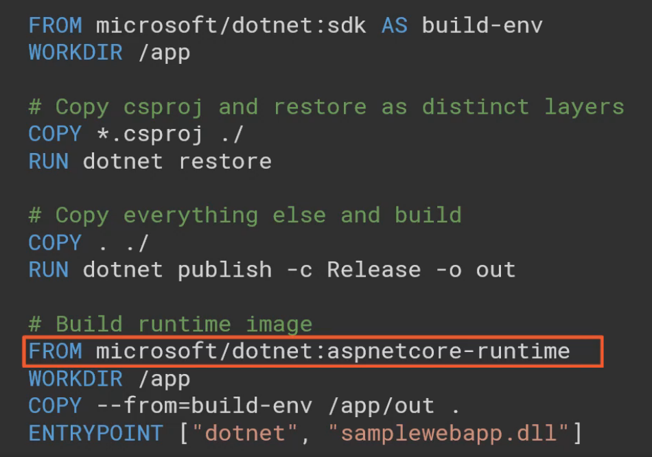

# Containers Overview

This repo is my place for recording notes and code related to containers, Docker, Kubernetes, and Helm.

## Resources

- [Microsoft quickstart guide to developing on Azure Kubernetes Service (AKS)](https://docs.microsoft.com/en-us/azure/aks/quickstart-helm)
- [Microsoft guide to running existing applications on AKS using Helm](https://docs.microsoft.com/en-us/azure/aks/kubernetes-helm)

## Tools

- Docker
- Kubernetes
- Helm

## Terms

- container
- cluster - a collection of container hosts
- nodes - servers running in the cluster that actually host containers
- container orchestrators - manage how containers are deployed and run across the nodes
- volume
- pods

## Highlights of Containers and Kubernetes

- Containers use a **layered** approach to hosting images, in which an image is comprised of it's application and dependencies.
- Images are defined using instructions in a **Dockerfile**, which can be named and versioned using **tags**
- Images are stored in **container registries**, that can be **private** (Azure Container Registry) or **public** (DockerHub)
- Docker hosts can allocate memory, CPU, disk, and network access
- Containers should use **Volumes** to store data rather than storing data within the container

## Benefits of Containers

- Isolation
- Portability
- Efficient
- Fast Start
- Disposable
- Minimal attack surface area

## Ways to Run Containers in Azure

1. Azure Container Instances (ACI) - billed by the second, fast and easy
2. Azure Web Apps for Containers - great for web apps, custom domains, auto-scaling
3. Azure Service Fabric - scalable platform, powers key Azure services
4. Azure Kubernets Service (AKS) - managed Kubernetes service, just specify the node count
5. IaaS VMs - Linux or Windows

## Running Docker Locally

### Docker Run

Docker will run a new container specified in the command.

```powershell
docker run -d -p 25565:25565 --name myserver itzg/minecraft-server:v1
```

- **-d** specified "detached" mode
- **-p** specifies the port mapping from the container to the host port
- **-name** specifies the name of the server

The folowing example will link two containers and run the sh terminal

```powershell
docker run -it --rm --link redis1:redis --name client1 redis sh
```
- **-id** - specifies an **interactive** session
- **-rm** - tells docker to close the container once the sh shell is closed
- **-link** - will link the client1 container to the redis1 container in a secure manner, and call it "redis" for the duration of this session

### Docker PS

See which containers are running.

```powershell
docker ps <myContainerName> -a
```

- **-a** will show all images, even stopped images

### Docker Logs

Shows logs from the containers

```powershell
docker logs
```

### Docker Exec

Can be used to execute a command within a container

```powershell
docker exec -it <myContainerName> sh
```

### Docker Images

```powershell
docker images
```

### Docker Volumes

```powershell
docker volumes
```

### Docker Rm

Removes an image

```powershell
docker rm <name>
```
Removes an image after forcing a stop

```powershell
docker rm -f <name>
```

### Docker Stop

Will stop a container

```powershell
docker stop <name>
```

## Docker Examples

Download a Potgres image from DockerHub and map it to a data volume

```powershell
docker run -d -p 5432:5432 -v postgres-data:/var/lib/postgressql/data --name postgres1 postgres
```

- **-v** - specifies the volume to use and the folder it maps to within the container.  If the volume doesn't exist, it will be created
- **-name** - specifies the DockerHub image and the name of our image

### Multi-stage Docker Build that Builds then Publishes




## Kubernetes

### Run on Each Node

- kubelet
- kube-proxy
- container runtime

### Pods

- Pods are wrappers around containers that run on Kubernetes.
- Pods can hold one or more containers.

#### Pod Lifecycle Phases

- Pending
- Running
- Succeeded
- Failed
- Unknown

### Kubernetes Service

A Kubernetes Service provides communication between nodes, pods, and users.